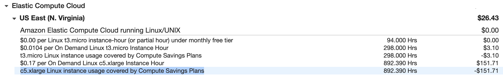

## AWS Saving Plan Report

**Introduction**

- Savings Plans is a pliable pricing method that offers a reduction of up to 72% on your AWS compute consumption. This pricing model provides less commercial on Amazon EC2 instances consumption, irrespective of instance family, size, OS, tenancy, or AWS Region, and also implies to AWS Fargate and AWS Lambda consumption.

- Savings Plans offer an effective reduction over On Demand, just like EC2 Reserved Instances, in replace for a fixed to use a particular value of computing power (measured in $/hour) for a one or three year timeframe. 

- We can sign up for Savings Plans for a 1- or 3-year term and simply control the plans by taking the merits of suggestions, performance reporting, and budget alerts in the AWS Cost Explorer.

- Once we have subscribed to Savings Plans below is a quick reference guide to exploring the Savings Plans reports.

**#1: Leveraging the utilization report**

  - Savings Plans utilization presents the percentage of the Savings Plans commitment that we are leveraging across the compute consumption.

  - We can access it from <a href="https://console.aws.amazon.com/cost-management/home?region=us-east-1#/savings-plans/coverage">AWS Cost Management</a> Cost Explorer > Savings Plans > Utilization report

    

**#2: Leveraging the coverage report**

  - Savings Plans coverage report presents how much of the eligible spend was covered by the Savings Plans, based on the selected time period.

  - We can access it from <a href="https://console.aws.amazon.com/cost-management/home?region=us-east-1#/savings-plans/utilization">AWS Cost Management</a> Cost Explorer > Savings Plans > Coverage report
  
    

    **Note:** The column “Spend covered by Savings Plan” depicts the On-demand equivalent and the column “On-demand spend” depicts the On-demand spent not covered by Savings Plan. 

**#3: Monthly billing**

  - Monthly pricing of the Savings Plans purchase (Depends on the subscription option - would be $0 for all upfront Savings Plans)

    

  - Similar to on-demand spend covered by the Savings Plans

    

